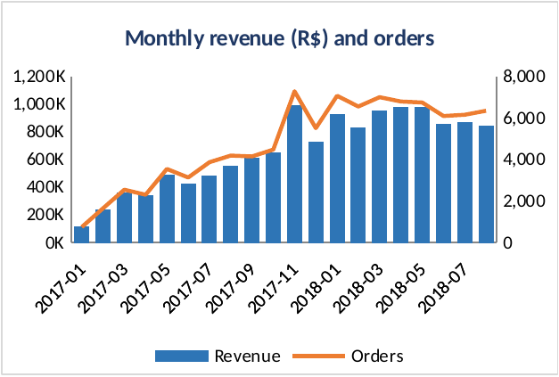
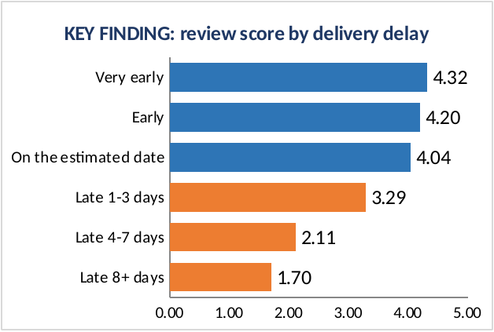
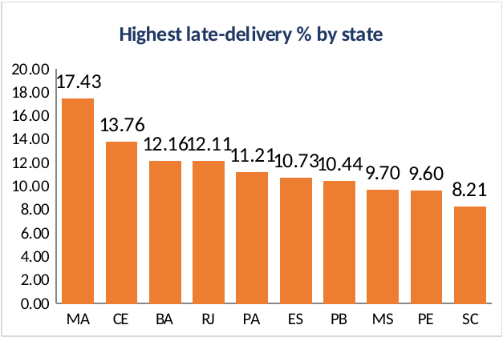
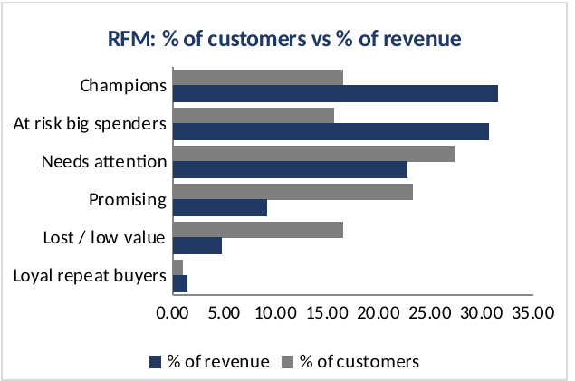
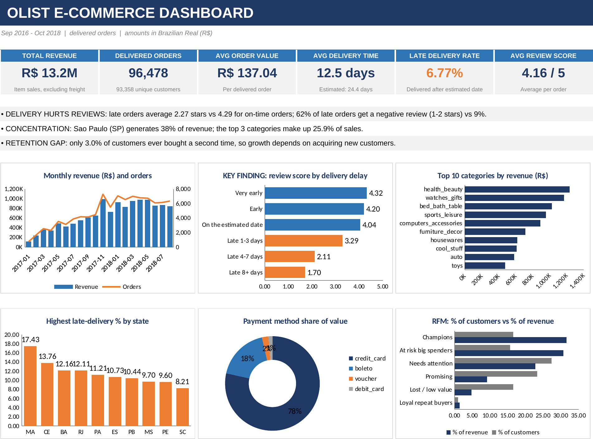

# Olist E-Commerce Sales and Delivery Analysis

**End-to-end business analytics project using MySQL and Excel on 96,478 delivered orders from a Brazilian online marketplace.**


---

## Table of Contents
1. [About the Project](#about-the-project)
2. [Business Problem](#business-problem)
3. [Objectives](#objectives)
4. [Tools and Technologies](#tools-and-technologies)
5. [Dataset](#dataset)
6. [Methodology](#methodology)
7. [Key Findings](#key-findings)
8. [Dashboard](#dashboard)
9. [Business Recommendations](#business-recommendations)
10. [Project Structure](#project-structure)
11. [Conclusion and Future Scope](#conclusion-and-future-scope)

---

## About the Project

An online marketplace can look healthy on sales alone while quietly losing customers to late deliveries and poor service. This project joins nine separate tables of order, delivery, payment, seller and review data into one analysis, finds what drives customer dissatisfaction, and turns the results into a one-page Excel dashboard and a prioritised action plan.

The data work is done in **MySQL** (loading, cleaning, 20 analysis queries) and the results are presented in **Excel**. A full written report is included in Word and PDF.

| | |
|---|---|
| **Delivered orders analysed** | 96,478 |
| **Customers** | 93,358 |
| **Revenue** | R$ 13.22 million |
| **Period** | September 2016 to October 2018 |
| **Tables used** | 8 (550,759 rows) |

## Business Problem

> *Where, when and why does the marketplace lose customer satisfaction and repeat business, and what should it do about it?*

The scenario is a learning framing: an analyst supporting the operations and customer-experience leadership of an online marketplace. No company engaged me, and all results come from a public dataset.

## Objectives

1. Measure sales performance and growth over time.
2. Find which categories and regions drive revenue.
3. Quantify delivery performance and its link to customer reviews.
4. Identify the best and weakest sellers.
5. Measure customer retention and segment customers by value.
6. Deliver a one-page executive dashboard with recommendations.

## Tools and Technologies

| Area | Tools |
|---|---|
| Database and analysis | MySQL 8, MySQL Workbench |
| SQL techniques | Joins, CTEs, window functions (`LAG`, `RANK`, `NTILE`, `FIRST_VALUE`, running totals), `CASE`, date functions |
| Dashboard | Microsoft Excel (tables, formulas, charts, conditional formatting) |
| Documentation |  PDF report, Git and GitHub |

## Dataset

| Item | Detail |
|---|---|
| **Source** | [Brazilian E-Commerce Public Dataset by Olist](https://www.kaggle.com/datasets/olistbr/brazilian-ecommerce) on Kaggle |
| **Tables used** | customers, sellers, products, orders, order items, payments, reviews, category translation |
| **Records** | 99,441 orders, 112,650 order items, 103,886 payments, 99,224 reviews |
| **Not used** | The geolocation file (about 1 million rows). It is not needed for this analysis and is not included here |
| **Target variable** | None. This is descriptive and diagnostic analysis |
| **Licence** | Listed on Kaggle as CC BY-NC-SA 4.0 (non-commercial, share-alike) |


## Methodology

```
CSV files -> MySQL tables -> Quality checks -> Analysis -> Excel dashboard -> Recommendations
```

1. **Load.** Created 8 tables with keys and indexes, then loaded the CSV files. Row counts were checked against the expected counts.
2. **Check quality.** Ran 10 checks for missing dates, orphan keys, duplicates and illogical dates.
3. **Clean and prepare.** Built `order_summary` (one row per order) and `item_detail` (one row per item). Items, payments and reviews were summed or averaged *before* joining, so revenue is never double counted. A control query confirms identical revenue totals before and after.
4. **Analyse.** Wrote 20 queries across sales, products, regions, payments, delivery, sellers and customers.
5. **Visualise.** Exported the results to Excel and built a one-page dashboard whose cards and charts link to the result sheets.
6. **Recommend.** Turned the findings into prioritised actions with owners, KPIs and impact scenarios.

**Business rules:** revenue is the sum of item prices in delivered orders (freight excluded). An order is late if it arrived on a date after the estimated delivery date. Customers are counted by `customer_unique_id`.

## Key Findings

| # | Finding |
|---|---|
| 1 | **Delivery drives satisfaction.** Late orders average 2.27 stars against 4.29 for on-time orders. 62% of late orders get a 1 or 2-star review, against 9% |
| 2 | **Reviews fall as delays grow.** 4.32 (very early), 3.29 (1 to 3 days late), 2.11 (4 to 7 days) and 1.70 (8+ days late) |
| 3 | **Delays cluster in time.** The late rate peaked at 12.4% (Nov 2017), 14.1% (Feb 2018) and 19.0% (Mar 2018), against roughly 2% to 7% in normal months |
| 4 | **Delays cluster in place.** Highest late rates: MA 17.4%, CE 13.8%, BA 12.2%, RJ 12.1%, against 4.5% in SP. Delivery takes 8.7 days in SP but 19 to 21 days in BA, CE and MA |
| 5 | **Customers rarely return.** Only 3.0% buy a second time, and month-1 cohort retention is about 0.5% |
| 6 | **Revenue is concentrated.** São Paulo is 38% of revenue. 18 of 74 categories (24%) generate about 81% of revenue |
| 7 | **Valuable customers are going quiet.** "At-risk big spenders" are 15.6% of customers but 30.6% of revenue, inactive for about 394 days |
| 8 | **The delivery promise is very cautious.** Estimated 24.4 days against 12.5 days actual, and 74% of orders arrive 8 or more days early |
| 9 | **Payments.** Credit card is 78.5% of payment value and boleto is 18.0%. Large purchases are paid in instalments |

### Headline KPIs

| Revenue | Delivered orders | Customers | Avg order value | Avg delivery | Late rate | Avg review |
|---|---|---|---|---|---|---|
| R$ 13.22M | 96,478 | 93,358 | R$ 137.04 | 12.5 days | 6.77% | 4.16 / 5 |

<p align="center">
  
  
</p>
<p align="center">
  
  
</p>

All 20 query results, with the business question for each, are in the [full report](documents/Olist_E_Commerce_sales_analysis_report.pdf).

## Dashboard

A one-page Excel dashboard with six KPI cards, three key insights and six charts: monthly revenue and orders, review score by delivery delay, top categories, late rate by state, payment mix and customer segments. The cards, insights and charts are linked by formulas to the 20 SQL result sheets, so they update when the results change. The workbook also has a longer dashboard, a cohort retention heat map and one formatted sheet per query.



## Business Recommendations

| Rank | Recommendation | Evidence |
|---|---|---|
| 1 | Watch open orders near the promised date, alert customers and escalate severe delays | 2,862 orders arrived 8+ days late, with a 1.70 average review |
| 2 | Prepare carrier capacity for peak months (November, February to March) | Late rate reached 12.4%, 14.1% and 19.0% in peak months |
| 3 | Improve regional logistics for MA, CE, BA, AL, SE and RJ, and recruit sellers closer to them | Late rates of 12% to 21% against 4.5% in SP |
| 4 | Run seller scorecards with minimum review and on-time standards | 10 sellers score 2.27 to 3.08; a top-10 seller scores 3.35 |
| 5 | Launch a second-purchase offer in the first 30 to 60 days | Only 3.0% of customers repeat |
| 6 | Win back at-risk big spenders | 14,563 customers hold 30.6% of revenue |
| 7 | Test route-based delivery estimates and regional free-shipping thresholds | Estimate 24.4 days against 12.5 days actual; freight is 26% of revenue in MA against 14% in SP |

**Illustrative impact (scenario estimates, not forecasts):** cutting late orders by half would lift the average review from 4.16 to about 4.23 and remove about 1,700 one- and two-star reviews. Raising the repeat rate by one point would add about R$ 128K revenue, and reactivating 5% of at-risk big spenders about R$ 202K.


## Project Structure

```
olist-ecommerce-analytics/
├── README.md
├── .gitignore
│
├── data/
│   ├── data_dictionary.csv              # raw and derived tables
│   ├── raw/                             # original Olist CSV files used
│   ├── cleaned/                         # reviews and category translation prepared for MySQL
│   └── query_results/                   # 20 result tables exported from MySQL
│
├── sql/
│   ├── 01_create_database_and_tables.sql
│   ├── 02_load_data.sql
│   ├── 03_data_quality_and_cleaning.sql
│   └── 04_analysis_queries.sql
│
├── excel/
│   ├── Olist_OnePage_Dashboard.xlsx     # dashboard and 20 result sheets
│   └── dashboard_screenshot.png
│
└── documents/
    ├── Olist_Final_Project_Report.pdf   # full project report
    └── images/                          # charts used in the report
```

## Conclusion and Future Scope

The marketplace is growing and its sales are healthy, but its main weakness is experience and loyalty. Late deliveries sharply lower satisfaction, delays are concentrated in particular regions, months and sellers, and almost no customers come back. Fixing delivery control, regional logistics, seller standards and retention gives the clearest return.

**Next steps:** predict late deliveries and negative reviews with machine learning, forecast demand for peak planning, analyse the Portuguese review text, map seller-to-customer distance with the geolocation data, estimate customer lifetime value, and rebuild the dashboard in Power BI or Tableau.


